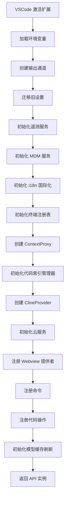
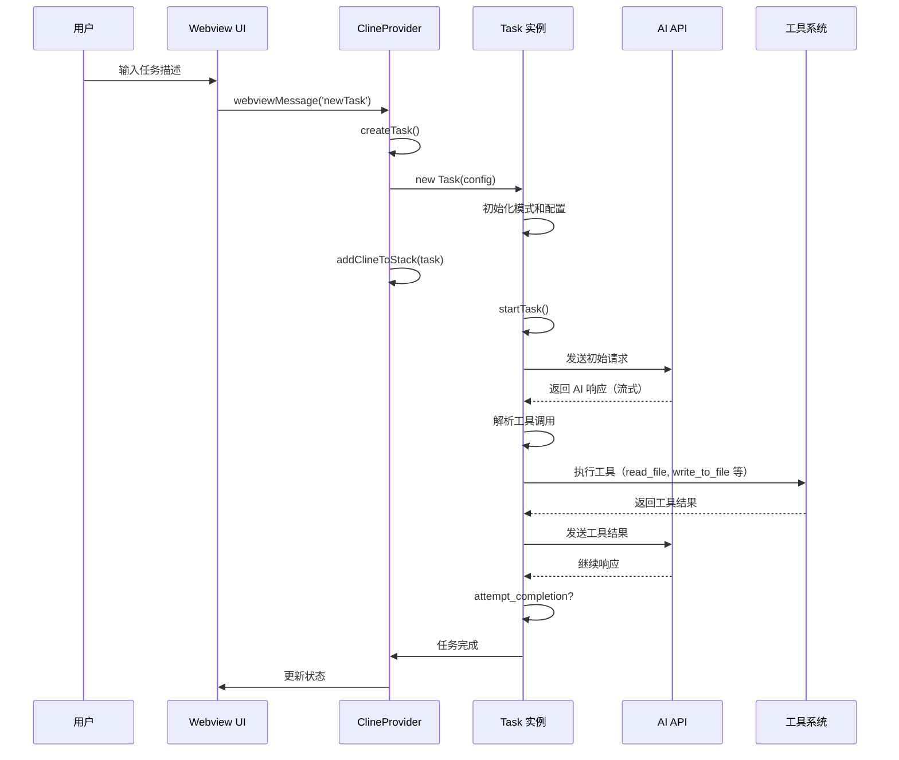
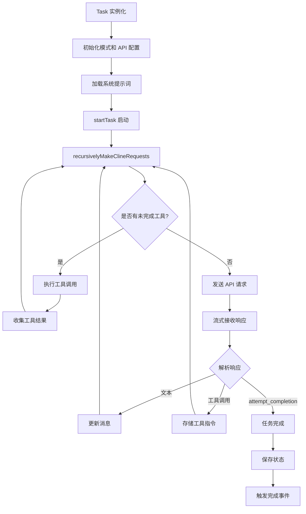
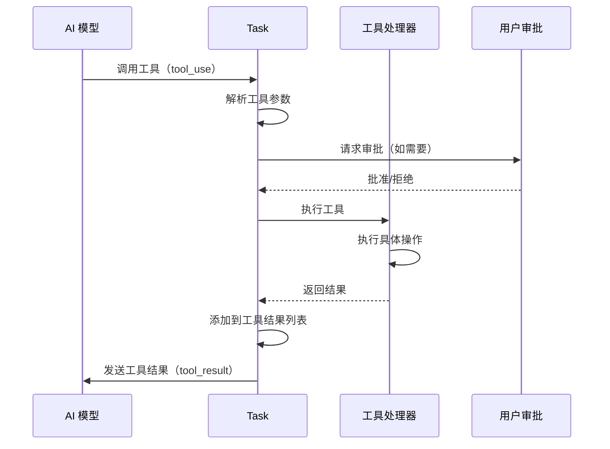
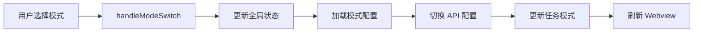
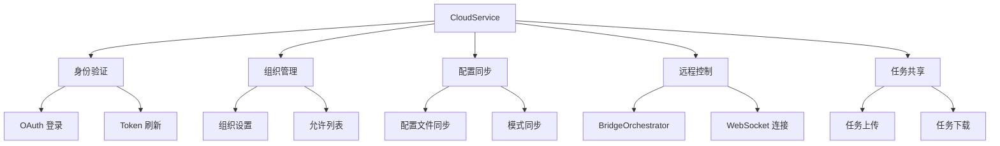
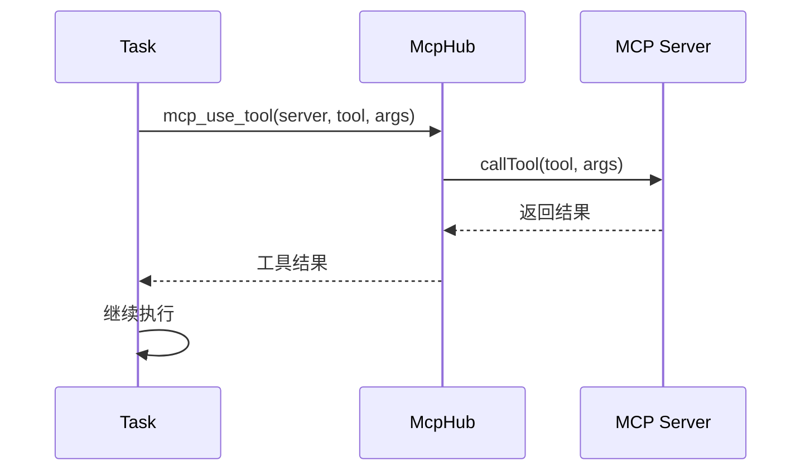
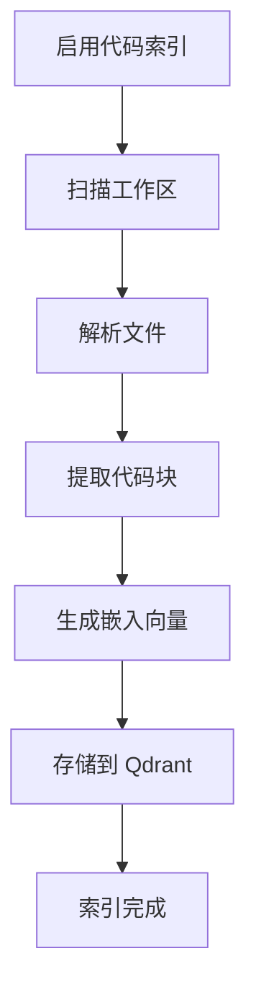
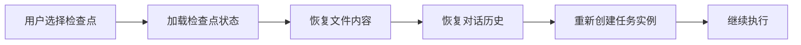
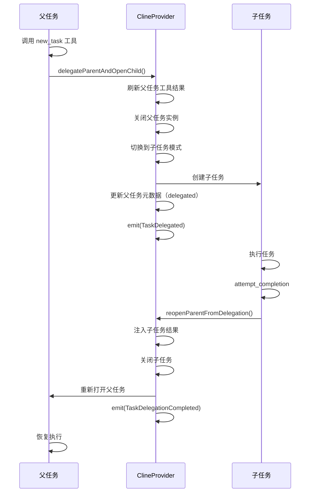

# Roo-Code 主流程文档

## 项目概述

Roo-Code 是一个基于 VSCode 的 AI 驱动编码助手扩展，支持多种工作模式和 AI 提供商，能够帮助开发者进行代码生成、重构、调试、文档编写等任务。

### 核心特性

- **多模式支持**：Code（编码）、Architect（架构）、Ask（问答）、Debug（调试）等内置模式及自定义模式
- **多 AI 提供商**：支持 Anthropic、OpenRouter、OpenAI、Bedrock、Vertex AI 等
- **工具集成**：文件读写、命令执行、浏览器控制、MCP 服务器等
- **任务管理**：支持任务委托、子任务、检查点、上下文压缩等
- **云服务集成**：支持远程控制、组织管理、配置同步等

---

## 一、架构概览

### 1.1 项目结构

```
Roo-Code/
├── src/                      # 核心扩展代码
│   ├── extension.ts         # 扩展入口点
│   ├── activate/            # 激活相关代码
│   ├── api/                 # AI 提供商 API 实现
│   ├── core/                # 核心业务逻辑
│   │   ├── webview/        # Webview 提供者
│   │   ├── task/           # 任务执行
│   │   ├── config/         # 配置管理
│   │   └── tools/          # 工具实现
│   ├── services/           # 各类服务
│   │   ├── mcp/           # MCP 服务器管理
│   │   ├── code-index/    # 代码索引
│   │   ├── checkpoints/   # 检查点服务
│   │   └── marketplace/   # 市场管理
│   └── integrations/       # 集成功能
├── webview-ui/             # React 前端界面
└── packages/               # 共享包
    ├── types/             # TypeScript 类型定义
    ├── cloud/             # 云服务
    ├── telemetry/         # 遥测
    └── ipc/               # 进程间通信
```

### 1.2 核心组件

| 组件                 | 文件路径                             | 职责                                   |
| -------------------- | ------------------------------------ | -------------------------------------- |
| **Extension**        | `src/extension.ts`                   | 扩展激活入口，初始化所有服务           |
| **ClineProvider**    | `src/core/webview/ClineProvider.ts`  | 主要提供者，管理 webview、任务栈、状态 |
| **Task**             | `src/core/task/Task.ts`              | 单个任务实例，处理 AI 交互和工具调用   |
| **API**              | `src/extension/api.ts`               | 外部 API 接口，支持程序化控制          |
| **ContextProxy**     | `src/core/config/ContextProxy.ts`    | 配置和状态管理代理                     |
| **McpHub**           | `src/services/mcp/McpHub.ts`         | MCP 服务器集成                         |
| **CodeIndexManager** | `src/services/code-index/manager.ts` | 代码库索引管理                         |

---

## 二、启动流程

### 2.1 扩展激活流程（`extension.ts::activate()`）



**关键步骤说明**：

1. **环境初始化**（lines 6-13）

    - 加载 `.env` 文件中的环境变量
    - 为开发和测试环境提供配置

2. **服务初始化**（lines 69-91）

    - 迁移旧版本设置到新格式
    - 初始化遥测服务（PostHog）
    - 初始化 MDM（移动设备管理）服务
    - 初始化国际化支持

3. **核心组件创建**（lines 101-127）

    - 创建 `ContextProxy`：统一的配置访问层
    - 为每个工作区文件夹创建 `CodeIndexManager`
    - 创建主 `ClineProvider` 实例

4. **云服务集成**（lines 129-252）

    - 初始化 CloudService 进行身份验证
    - 设置事件监听器（auth-state-changed、settings-updated）
    - 同步云端配置文件

5. **注册 VSCode 扩展点**（lines 254-314）
    - 注册 Webview 视图提供者
    - 注册命令处理器
    - 注册代码操作提供者
    - 注册 URI 处理器

---

## 三、任务执行主流程

### 3.1 任务创建流程



### 3.2 ClineProvider 任务管理

**ClineProvider 核心职责**：

1. **任务栈管理**（`clineStack`）

    ```typescript
    // 添加任务到栈顶（LIFO）
    addClineToStack(task: Task)

    // 移除栈顶任务
    removeClineFromStack()

    // 获取当前任务
    getCurrentTask(): Task | undefined
    ```

2. **状态管理**

    - 通过 `ContextProxy` 管理全局状态
    - 维护任务历史记录
    - 处理配置文件切换

3. **Webview 通信**
    ```typescript
    postMessageToWebview(message: ExtensionMessage)
    setWebviewMessageListener(webview: Webview)
    ```

### 3.3 Task 执行流程

**Task 类核心流程**（`src/core/task/Task.ts`）：



**关键方法**：

1. **`startTask()`**：任务入口

    - 加载历史消息
    - 初始化系统提示词
    - 开始递归请求循环

2. **`recursivelyMakeClineRequests()`**：主循环

    - 检查并执行待处理工具
    - 发送 API 请求
    - 处理流式响应
    - 解析和执行工具调用
    - 循环直到任务完成或中止

3. **`executeToolCall()`**：工具执行
    - 根据工具名称分发到具体工具处理器
    - 返回工具执行结果

---

## 四、工具系统

### 4.1 可用工具列表

| 工具名称                     | 功能                   | 实现位置                        |
| ---------------------------- | ---------------------- | ------------------------------- |
| `execute_command`            | 执行终端命令           | Task 内部                       |
| `read_file`                  | 读取文件内容           | `core/tools/`                   |
| `write_to_file`              | 写入文件               | `core/tools/WriteToFileTool.ts` |
| `search_files`               | 搜索文件内容           | `core/tools/SearchFilesTool.ts` |
| `list_files`                 | 列出目录文件           | Task 内部                       |
| `list_code_definition_names` | 列出代码定义           | Task 内部                       |
| `search_codebase`            | 搜索代码库（需要索引） | Task 内部                       |
| `browser_action`             | 浏览器操作             | Task 内部                       |
| `mcp_use_tool`               | 使用 MCP 工具          | Task 内部                       |
| `new_task`                   | 创建子任务             | Task 内部                       |
| `switch_mode`                | 切换模式               | Task 内部                       |
| `update_todo_list`           | 更新待办列表           | Task 内部                       |
| `attempt_completion`         | 完成任务               | Task 内部                       |
| `ask_followup_question`      | 询问后续问题           | Task 内部                       |

### 4.2 工具执行流程



---

## 五、模式系统

### 5.1 内置模式

| 模式               | Slug                 | 用途                     |
| ------------------ | -------------------- | ------------------------ |
| Code               | `code`               | 日常编码、文件操作       |
| Architect          | `architect`          | 系统设计、规划、迁移     |
| Ask                | `ask`                | 快速问答、解释、文档     |
| Debug              | `debug`              | 问题追踪、日志、根因分析 |
| Orchestrator       | `orchestrator`       | 复杂多步骤项目协调       |
| Test               | `test`               | 测试编写和维护           |
| Design Engineer    | `design-engineer`    | UI 设计实现              |
| Translate          | `translate`          | 本地化管理               |
| Issue Fixer        | `issue-fixer`        | GitHub Issue 修复        |
| Issue Investigator | `issue-investigator` | Issue 调查分析           |
| Merge Resolver     | `merge-resolver`     | 合并冲突解决             |

### 5.2 模式切换流程



**核心逻辑**（`ClineProvider::handleModeSwitch()`）：

1. 更新任务历史中的模式
2. 更新全局状态
3. 加载该模式保存的 API 配置
4. 触发 Webview 更新

---

## 六、配置管理

### 6.1 配置层级

```
配置层级（优先级从高到低）：
1. 任务特定配置（运行时）
2. 模式关联的 API 配置
3. 当前激活的 API 配置
4. 默认配置
```

### 6.2 Provider Profile（提供商配置文件）

**ProviderSettingsManager** 管理多个配置文件：

```typescript
interface ProviderSettingsEntry {
  id: string
  name: string
  apiProvider: 'anthropic' | 'openrouter' | 'openai' | ...
  apiModelId?: string
  apiKey?: string
  // ... 其他配置
}
```

**配置管理流程**：

1. 用户创建/编辑配置文件
2. 保存到 `globalState`
3. 激活配置时，加载到 `ContextProxy`
4. 任务使用当前激活的配置

---

## 七、状态持久化

### 7.1 存储位置

| 存储类型      | 位置                        | 用途                 |
| ------------- | --------------------------- | -------------------- |
| GlobalState   | VSCode 扩展存储             | 配置、历史、API 密钥 |
| SecretStorage | VSCode 安全存储             | API 密钥（加密）     |
| 文件系统      | `~/.roo-code/` 或自定义路径 | 任务数据、检查点     |

### 7.2 任务存储结构

```
全局存储路径/
├── tasks/
│   ├── {taskId}/
│   │   ├── api_conversation_history.json  # API 对话历史
│   │   ├── ui_messages.json               # UI 消息
│   │   ├── checkpoints/                   # 检查点
│   │   └── tool_results.json              # 工具结果
```

---

## 八、云服务集成

### 8.1 CloudService 功能



### 8.2 远程控制（Roomote Control）

**BridgeOrchestrator** 实现：

- WebSocket 连接到云端
- 订阅任务事件
- 支持远程任务控制
- 实时状态同步

---

## 九、MCP（Model Context Protocol）集成

### 9.1 MCP 架构

```
McpHub
  └── McpServerManager
       ├── Server 1 (stdio)
       ├── Server 2 (SSE)
       └── Server 3 (custom)
```

### 9.2 MCP 工具调用流程



---

## 十、代码索引（Code Indexing）

### 10.1 索引流程



### 10.2 使用场景

- `search_codebase` 工具：语义搜索代码库
- 上下文增强：自动查找相关代码
- 智能建议：基于代码库的建议

---

## 十一、检查点系统

### 11.1 检查点类型

1. **ShadowCheckpointService**：Git Shadow 仓库

    - 为每个任务创建独立分支
    - 自动提交变更
    - 支持回滚

2. **定时检查点**：
    - 每隔一定时间自动创建
    - 保存完整任务状态

### 11.2 检查点恢复



---

## 十二、事件系统

### 12.1 任务事件

```typescript
enum RooCodeEventName {
	TaskCreated = "taskCreated",
	TaskStarted = "taskStarted",
	TaskCompleted = "taskCompleted",
	TaskAborted = "taskAborted",
	TaskFocused = "taskFocused",
	TaskUnfocused = "taskUnfocused",
	TaskActive = "taskActive",
	TaskInteractive = "taskInteractive",
	TaskResumable = "taskResumable",
	TaskIdle = "taskIdle",
	TaskPaused = "taskPaused",
	TaskUnpaused = "taskUnpaused",
	TaskSpawned = "taskSpawned",
	TaskDelegated = "taskDelegated",
	TaskDelegationCompleted = "taskDelegationCompleted",
	// ...
}
```

### 12.2 事件流转

```
TaskCreated → TaskStarted → TaskActive →
[TaskInteractive ⇄ TaskActive] →
TaskCompleted/TaskAborted
```

---

## 十三、子任务委托

### 13.1 委托流程



---

## 十四、错误处理

### 14.1 常见错误场景

1. **API 请求失败**

    - 重试机制
    - 流式响应中断处理
    - 任务重新实例化

2. **工具执行失败**

    - 错误消息返回给 AI
    - 用户通知
    - 继续执行其他工具

3. **检查点恢复失败**
    - 回退到上一个有效检查点
    - 通知用户

### 14.2 任务中止

```typescript
// 用户取消
task.abortReason = "user_cancelled"
task.abortTask()

// 流式失败
task.abortReason = "streaming_failed"
// 自动重新实例化
```

---

## 十五、性能优化

### 15.1 上下文压缩

**自动压缩**（`autoCondenseContext`）：

- 当上下文接近限制时自动触发
- 使用单独的 API 配置进行压缩
- 保留关键信息，压缩历史对话

### 15.2 批处理

- 文件读取：并发读取多个文件
- 嵌入生成：批量生成嵌入向量
- API 请求：复用连接，减少延迟

---

## 十六、安全性

### 16.1 命令白名单/黑名单

```typescript
// 允许的命令
allowedCommands: ["git log", "git diff"]

// 禁止的命令
deniedCommands: ["rm -rf", "sudo"]
```

### 16.2 组织允许列表

- 限制可用的 AI 提供商
- 限制可用的模型
- MDM（移动设备管理）合规检查

### 16.3 文件访问控制

- 工作区内/外文件分别控制
- 只读/读写权限
- 受保护文件警告

---

## 十七、扩展 API

### 17.1 程序化控制

```typescript
// 获取 API 实例
const rooCodeApi = vscode.extensions.getExtension('RooVeterinaryInc.roo-cline')?.exports

// 创建任务
await rooCodeApi.startNewTask({
  configuration: {...},
  text: "任务描述",
  images: []
})

// 取消任务
await rooCodeApi.cancelTask(taskId)

// 配置管理
await rooCodeApi.setConfiguration({...})
const config = rooCodeApi.getConfiguration()
```

### 17.2 IPC 服务器

支持外部进程通过 Unix Socket 控制：

```bash
ROO_CODE_IPC_SOCKET_PATH=/tmp/roo-code.sock
```

---

## 十八、Webview UI

### 18.1 技术栈

- **React**：UI 框架
- **TypeScript**：类型安全
- **Tailwind CSS**：样式
- **VSCode Webview Toolkit**：UI 组件

### 18.2 通信协议

```typescript
// Extension → Webview
interface ExtensionMessage {
  type: 'state' | 'action' | 'invoke' | ...
  [key: string]: any
}

// Webview → Extension
interface WebviewMessage {
  type: 'newTask' | 'askResponse' | 'apiConfiguration' | ...
  [key: string]: any
}
```

---

## 十九、开发和调试

### 19.1 开发模式

```bash
# 安装依赖
pnpm install

# 启动开发模式（F5）
# 自动热重载
```

### 19.2 日志和调试

- **Output Channel**：`outputChannel.appendLine()`
- **Console**：浏览器开发工具（Webview）
- **调试配置**：`.vscode/launch.json`

---

## 二十、总结

### 20.1 核心流程总结

```
启动流程：
Extension.activate() → 初始化服务 → 创建 ClineProvider → 注册 Webview

任务流程：
用户输入 → 创建 Task → 发送 API 请求 → 解析响应 → 执行工具 → 循环 → 完成

工具流程：
AI 调用工具 → 用户审批 → 执行工具 → 返回结果 → AI 继续

模式流程：
切换模式 → 更新配置 → 加载模式专用设置 → 更新 UI

委托流程：
父任务 → 创建子任务 → 切换模式 → 执行子任务 → 返回结果 → 恢复父任务
```

### 20.2 关键设计原则

1. **单一任务不变性**：同一时间只有一个活动任务
2. **状态持久化**：所有关键状态都持久化到存储
3. **事件驱动**：组件间通过事件通信，松耦合
4. **模式化设计**：不同工作模式有不同的系统提示和配置
5. **可扩展性**：支持自定义模式、MCP 服务器、工具等

### 20.3 未来扩展点

- 更多 AI 提供商支持
- 更强大的代码索引和搜索
- 团队协作功能
- 更多内置工具
- 插件系统

---

## 附录

### A. 重要文件清单

| 文件                                 | 说明           |
| ------------------------------------ | -------------- |
| `src/extension.ts`                   | 扩展入口       |
| `src/core/webview/ClineProvider.ts`  | 主提供者       |
| `src/core/task/Task.ts`              | 任务执行       |
| `src/extension/api.ts`               | 外部 API       |
| `src/api/index.ts`                   | API 处理器构建 |
| `src/core/config/ContextProxy.ts`    | 配置管理       |
| `src/services/mcp/McpHub.ts`         | MCP 集成       |
| `src/services/code-index/manager.ts` | 代码索引       |
| `webview-ui/src/App.tsx`             | Webview 主界面 |

### B. 环境变量

| 变量                       | 说明            |
| -------------------------- | --------------- |
| `NODE_ENV`                 | 开发/生产环境   |
| `ROO_CODE_IPC_SOCKET_PATH` | IPC Socket 路径 |
| `POSTHOG_API_KEY`          | 遥测 API 密钥   |

### C. 配置项

参考 `src/package.json` 中的 `configuration` 部分，包括：

- 命令白名单/黑名单
- 终端设置
- 代码索引配置
- 等等

---

**文档版本**: v1.0  
**更新时间**: 2025-12-20  
**适用版本**: Roo-Code v3.36.x
